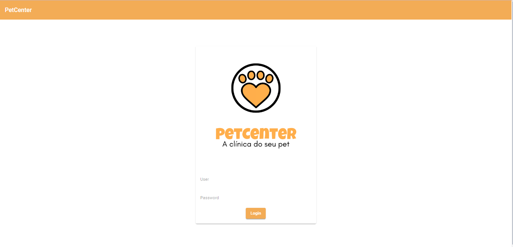

## PetCenter

PetCenter é um sistema web construído com Java 17 e Angular 14. O objetivo é fornecer ao usuário mais comodidade e praticidade ao usuário.

## Arquitetura ❄👌

- 

## Building 🏢🚀

1. Para o backend:
- Clone o repositório para seu computador local.
- Abra e execute o projeto com VS Code ou Android Studio 3.x

2. Para o backend:
- Clone o repositório para seu computador local.

